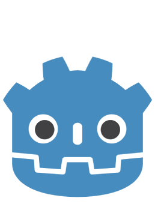
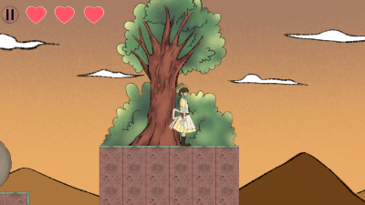
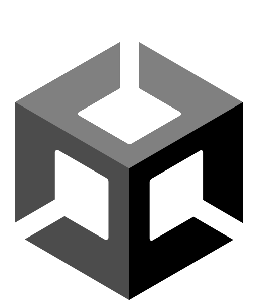

# Hello 👋

I'm <b>Maximillian Kenas</b>, a <b>Game Application & Technology</b> undergraduate at <b>BINUS University</b>. I'm a <b>game programmer</b> with a strong focus on <b>Godot</b>. I'm skilled in making 2D games and currently strengthening my skills in 3D games.

## 🎮 Highlight Projects 🎮
<table width="100%">
  <!-- === First row === --!>
  <thead>
    <!-- === Title === --!>
    <tr>
      <th width="50%"><b>Auntie Mega's Milk</b></th>
      <th width="50%"><b>Auntie Mega's Fish Tank</b></th>
    </tr>
  </thead>
  <tbody>
    <!-- === Visual === --!>
    <tr>
      <td></td>
      <td></td>
    </tr>
    <!-- === Description === --!>
    <tr>
      <td valign="text-top"">
An <b>idle milk game</b> where you manage a grab-and-go milk bar.
</td>
      <td valign="text-top"">
An <b>idle fishing game</b> where you catch & collect fish in a little always-on window while you do other tasks.
</td>
    </tr>
    <!-- === More info === --!>
    <tr>
      <td valign="text-top"">
Role: <b>Game Programmer</b> 👤 Time spent: <b>3 Days</b> ⌛ Made in Godot 
</td>
      <td valign="text-top"">
Role: <b>Game Programmer</b> 👤 Time spent: <b>7 Days</b> ⌛ Made in Godot 
</td>
    </tr>
    <!-- === Game link === --!>
    <tr>
      <td align="center">

</td>
      <td align="center">

</td>
    </tr>
  </tbody>
  <!-- === Second row === --!>
  <thead>
    <!-- === Title === --!>
    <tr>
      <th width="50%"><b>Inkcome!</b></th>
      <th width="50%"><b>Planet of Mei</b></th>
    </tr>
  </thead>
  <tbody>
    <!-- === Visual === --!>
    <tr>
      <td></td>
      <td></td>
    </tr>
    <!-- === Description === --!>
    <tr>
      <td valign="text-top"">
A <b>casual, overcook like game</b> where you manage a printing shop.
</td>
      <td valign="text-top"">
A <b>resource management game</b> where you manage a colony planet and thrive.
</td>
    </tr>
    <!-- === More info === --!>
    <tr>
      <td valign="text-top"">
Role: <b>Game Programmer</b> 👤 Time spent: <b>14 Days</b> ⌛ Made in Godot 
</td>
      <td valign="text-top"">
Role: <b>Game Programmer</b> 👤 Time spent: <b>30 Days</b> ⌛ Made in Godot 
</td>
    </tr>
    <!-- === Game link === --!>
    <tr>
      <td align="center">

</td>
      <td align="center">

</td>
    </tr>
  </tbody>
</table>

## 🕹️ Other Projects 🕹️
<table width="100%">
  <!-- === First row === --!>
  <thead>
    <!-- === Title === --!>
    <tr>
      <th width="50%"><b>Treeason</b></th>
      <th width="50%"><b>Nihilist Me</b></th>
    </tr>
  </thead>
  <tbody>
    <!-- === Visual === --!>
    <tr>
      <td></td>
      <td></td>
    </tr>
    <!-- === Description === --!>
    <tr>
      <td valign="text-top"">
A <b>2D platformer game</b> where you help Siti plant trees and restore nature.
</td>
      <td valign="text-top"">
A <b>short narrative-driven game</b> where you debate with other people.
</td>
    </tr>
    <!-- === More info === --!>
    <tr>
      <td valign="text-top"">
Role: <b>Team Manager</b> 👤 Time spent: <b>30 Days</b> ⌛ Made in Unity 
</td>
      <td valign="text-top"">
Role: <b>Game Developer</b> 👤 Time spent: <b>90 Days</b> ⌛ Made in Unity 
</td>
    </tr>
    <!-- === Game link === --!>
    <tr>
      <td align="center">

</td>
      <td align="center">

</td>
    </tr>
  </tbody>
  <!-- === Second row === --!>
  <thead>
    <!-- === Title === --!>
    <tr>
      <th width="50%"><b>Room For One More</b></th>
      <th width="50%"><b>Ghost of Mei</b></th>
    </tr>
  </thead>
  <tbody>
    <!-- === Visual === --!>
    <tr>
      <td></td>
      <td></td>
    </tr>
    <!-- === Description === --!>
    <tr>
      <td valign="text-top"">
A <b>cozy, space management game</b> where you arrange furnitures to satisfy the endless demands.
</td>
      <td valign="text-top"">
A <b>2D platformer game</b> where you catch spirits and busting ghost.
</td>
    </tr>
    <!-- === More info === --!>
    <tr>
      <td valign="text-top"">
Role: <b>Game Designer</b> 👤 Time spent: <b>7 Days</b> ⌛ Made in Unity 
</td>
      <td valign="text-top"">
Role: <b>Game Programmer</b> 👤 Time spent: <b>30 Days</b> ⌛ Made in Godot 
</td>
    </tr>
    <!-- === Game link === --!>
    <tr>
      <td align="center">

</td>
      <td align="center">

</td>
    </tr>
  </tbody>
</table>

## 📫 Contact
📌 Email: maximilliankenas520@gmail.com 
📌 LinkedIn: https://www.linkedin.com/in/maximillian-kenas-37250b38a 
<!-- 📌 Discord: maxxi280 --!>

<!--
readme ref:
https://github.com/Lemun8
https://github.com/VieroFamico/VieroFamico
https://github.com/rchtr-chn
-->
