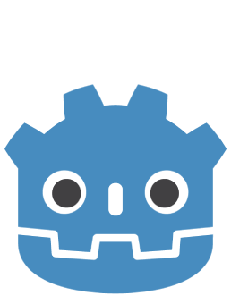
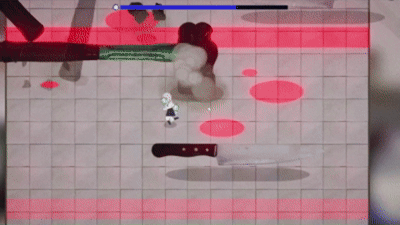
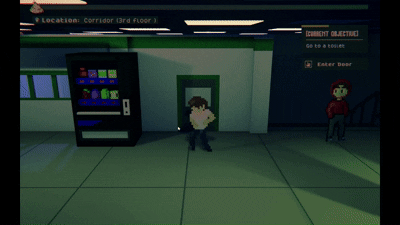
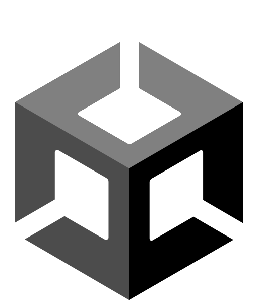

# Hello👋

I'm <b>Maximillian Kenas</b>, a <b>Game Application & Technology</b> undergraduate at <b>BINUS University</b>. I'm a <b>game programmer</b> with a decent experience on <b>Godot</b> and <b>Unity</b>. I'm skilled in making 2D games and currently strengthening my skills in 3D games.

## 🎮 Highlight Projects 🎮
<table width="100%">
  <!-- === First row === --!>
  <thead>
    <!-- === Title === --!>
    <tr>
      <th width="50%"><b>Auntie Mega's Fish Tank</b></th>
      <th width="50%"><b>Planet of Mei</b></th>
    </tr>
  </thead>
  <tbody>
    <!-- === Visual === --!>
    <tr>
      <td></td>
      <td></td>
    </tr>
    <!-- === Description === --!>
    <tr>
      <td valign="text-top">
An <b>idle fishing game</b> where you catch & collect fish in a little always-on window while you do other tasks.
</td>
      <td valign="text-top">
A <b>resource management game</b> where you manage a colony planet and thrive.
</td>
    </tr>
    <!-- === More info === --!>
    <tr>
      <td valign="text-top">
Role: <b>Game Programmer</b>👤 Time spent: <b>7 Days</b>⌛ Made in Godot 
</td>
      <td valign="text-top">
Role: <b>Game Programmer</b>👤 Time spent: <b>30 Days</b>⌛ Made in Godot 
</td>
    </tr>
    <!-- === Game link === --!>
    <tr>
      <td align="center">

</td>
      <td align="center">

</td>
    </tr>
  </tbody>
  <!-- === Second row === --!>
  <thead>
    <!-- === Title === --!>
    <tr>
      <th width="50%"><b>Household Chaos and Chores</b></th>
      <th width="50%"><b>Butt Pressure</b></th>
    </tr>
  </thead>
  <tbody>
    <!-- === Visual === --!>
    <tr>
      <td></td>
      <td></td>
    </tr>
    <!-- === Description === --!>
    <tr>
      <td valign="text-top">
A <b>chaotic survival and chores game</b> where you must stay alive in a flying-and-falling-object nightmare while doing chores.
</td>
      <td valign="text-top">
A <b>time-pressured puzzle game</b> where you have to find a toilet before the time runs out.
</td>
    </tr>
    <!-- === More info === --!>
    <tr>
      <td valign="text-top">
Role: <b>Game Programmer</b>👤 Time spent: <b>7 Days</b>⌛ Made in Unity 
</td>
      <td valign="text-top">
Role: <b>Game Programmer</b>👤 Time spent: <b>3 Days</b>⌛ Made in Unity 
</td>
    </tr>
    <!-- === Game link === --!>
    <tr>
      <td align="center">

</td>
      <td align="center">

</td>
    </tr>
  </tbody>
</table>

## 🕹️ Other Projects 🕹️
<table>
  <!-- === Header row === --!>
  <thead>
    <!-- === Colomn Title === --!>
    <tr>
      <th width="600px"><b>Name</b></th>
      <th width="150px"><b>Time Spent⌛</b></th>
      <th width="150px"><b>Made in⚙️</b></th>
      <th width="150px"><b>Play🎮</b></th>
    </tr>
  </thead>
  <tbody>
    <!-- === Game 1 === --!>
    <tr>
      <td>
Auntie Mega's Milk
</td>
      <td>
3 Days
</td>
      <td>
Godot 
</td>
      <td></td>
    </tr>
    <!-- === Game 2 === --!>
    <tr>
      <td>
Inkcome!
</td>
      <td>
14 Days
</td>
      <td>
Godot 
</td>
      <td></td>
    </tr>
    <!-- === Game 3 === --!>
    <tr>
      <td>
Treeason
</td>
      <td>
30 Days
</td>
      <td>
Unity 
</td>
      <td></td>
    </tr>
    <!-- === Game 4 === --!>
    <tr>
      <td>
Nihilist Me
</td>
      <td>
90 Days
</td>
      <td>
Unity 
</td>
      <td></td>
    </tr>
    <!-- === Game 5 === --!>
    <tr>
      <td>
Room For One More
</td>
      <td>
7 Days
</td>
      <td>
Unity 
</td>
      <td></td>
    </tr>
    <!-- === Game 6 === --!>
    <tr>
      <td>
Ghost of Mei
</td>
      <td>
2 Days
</td>
      <td>
Godot 
</td>
      <td></td>
    </tr>
    <!-- === Game 7 === --!>
    <tr>
      <td>
Auntie Mega's Milk Rush
</td>
      <td>
7 Days
</td>
      <td>
Unity 
</td>
      <td></td>
    </tr>
    <!-- === Game 8 === --!>
    <tr>
      <td>
Project Grin
</td>
      <td>
30 Days
</td>
      <td>
Unity 
</td>
      <td></td>
    </tr>
  </tbody>
</table>

## 📫 Contact
📌 Email: maximilliankenas520@gmail.com 
📌 LinkedIn: https://www.linkedin.com/in/maximillian-kenas 
📌 Discord: maxxi280

